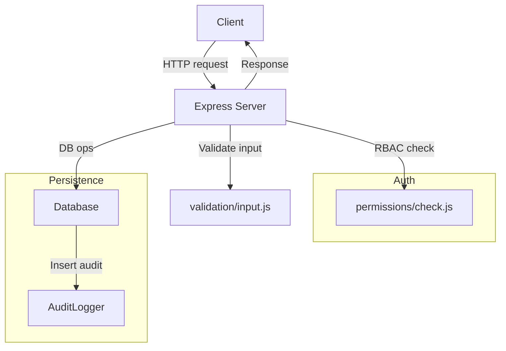

# Architecture Overview

```mermaid
flowchart TD
    Client -->|HTTP request| API[Express Server]
    API -->|Validate input| Validation[validation/input.js]
    API -->|RBAC check| RBAC[permissions/check.js]
    API -->|DB ops| DB[Database]
    DB -->|Insert audit| Audit[AuditLogger]
    API -->|Response| Client

    subgraph Auth
        RBAC
    end

    subgraph Persistence
        DB
        Audit
    end
```
