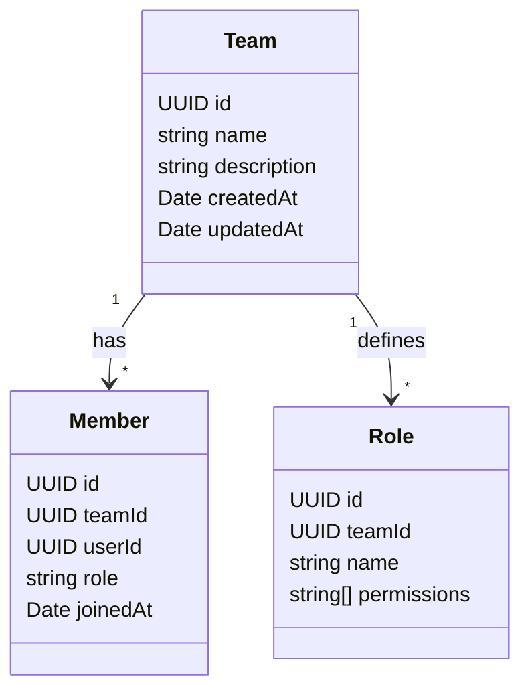

# DESIGN

## Overview

The **team‑collab‑api** is a multi‑tenant collaboration service that manages teams, members, roles, and permissions. It exposes a RESTful JSON API built with **Express** and **Node.js** (v20). Data is persisted in **PostgreSQL** (or an in‑memory fallback for tests).

## API Contract

| Resource   | Method   | Path                               | Description        | Request Body                              | Response                        |
| ---------- | -------- | ---------------------------------- | ------------------ | ----------------------------------------- | ------------------------------- |
| **Team**   | `POST`   | `/teams`                           | Create a new team  | `{ name: string, description?: string }`  | `201 Created` with team payload |
|            | `GET`    | `/teams/:teamId`                   | Get team details   | –                                         | `200 OK` with team payload      |
|            | `PATCH`  | `/teams/:teamId`                   | Update team        | `{ name?, description? }`                 | `200 OK`                        |
|            | `DELETE` | `/teams/:teamId`                   | Delete team        | –                                         | `204 No Content`                |
| **Member** | `POST`   | `/teams/:teamId/members`           | Add member to team | `{ userId: string, role: string }`        | `201 Created`                   |
|            | `GET`    | `/teams/:teamId/members`           | List members       | –                                         | `200 OK` array                  |
|            | `DELETE` | `/teams/:teamId/members/:memberId` | Remove member      | –                                         | `204 No Content`                |
| **Role**   | `POST`   | `/teams/:teamId/roles`             | Create role        | `{ name: string, permissions: string[] }` | `201 Created`                   |
|            | `GET`    | `/teams/:teamId/roles`             | List roles         | –                                         | `200 OK` array                  |
|            | `PATCH`  | `/teams/:teamId/roles/:roleId`     | Update role        | `{ name?, permissions? }`                 | `200 OK`                        |
|            | `DELETE` | `/teams/:teamId/roles/:roleId`     | Delete role        | –                                         | `204 No Content`                |

## Data Model (simplified)



## Security & Permissions

- **Authentication**: JWT signed with HS256. Tokens contain `sub` (user id) and `teamId` claims.
- **Authorization**: Middleware checks required permissions based on the role attached to the member record.
- **Audit Logging**: Every state‑changing request creates an entry via `logAudit()` with `performed_by`, `action`, `resource`, and optional `details` JSON.

## Validation

All incoming payloads are validated using **Joi** schemas located in `src/validation/input.js`. Validation errors result in a `400 Bad Request` with a standard error shape.

## Error Handling

All route handlers use the `toAppError` utility to produce a consistent error response:

```json
{ "status": "error", "code": 400, "message": "Invalid payload", "details": { ... } }
```

## Future Extensions

- WebSocket notifications for real‑time updates
- Role hierarchy and permission inheritance
- Multi‑region deployment with read replicas

---

_Design drafted to guide implementation, testing, CI/CD, and documentation phases._
